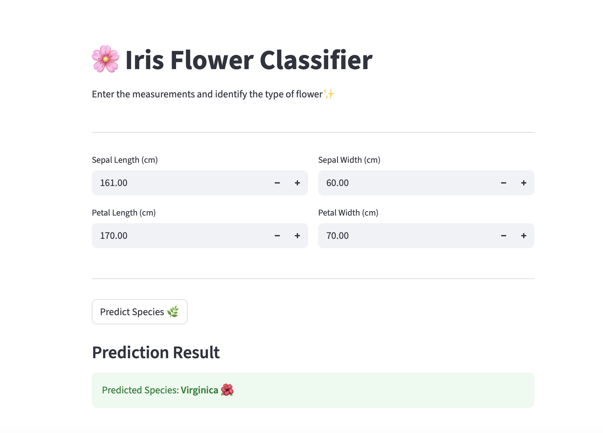

# 🚀 Streamlit Exercises - BMI & Iris Classifier

This project contains two interactive web applications built using Streamlit:

- 🧮 BMI Calculator
- 🌸 Iris Flower Classifier

---

## 📁 Project Structure

```text
Streamlit Exercises/

├── bmi_app.py
├── iris_app.py
├── iris_model.pkl
├── train_model.py
├── requirements.txt
│
└── images/
├── img1.png   (BMI App)
├── img2.png   (Iris App)
```
---

## 🧮 BMI Calculator

A simple app that calculates Body Mass Index (BMI) based on user input:

### Features:
- Input height (meters)
- Input weight (kg)
- Calculates BMI
- Shows health category:
  - Underweight
  - Normal
  - Overweight
  - Obese

### Screenshot:



---

## 🌸 Iris Flower Classifier

A machine learning app that predicts Iris flower species using a trained model.

### Features:
- Uses trained ML model (`iris_model.pkl`)
- Inputs:
  - Sepal length
  - Sepal width
  - Petal length
  - Petal width
- Predicts species:
  - Setosa
  - Versicolor
  - Virginica

### Screenshot:


---

## ⚙️ Installation

Install dependencies:

```bash
pip install -r requirements.txt

```


## ▶️ Run the Apps

BMI App:
streamlit run bmi_app.py
