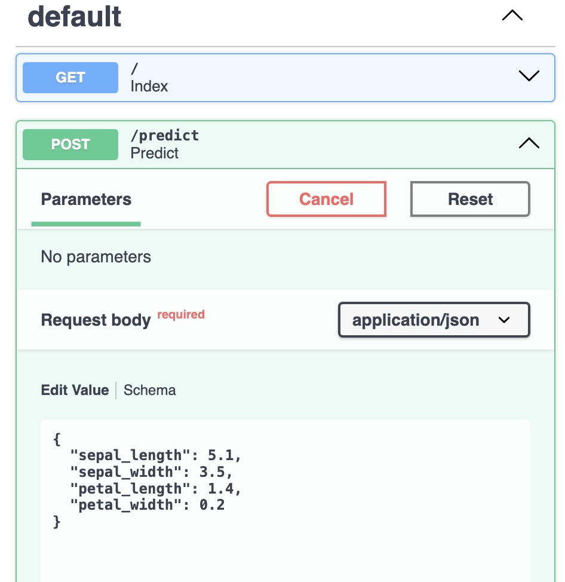
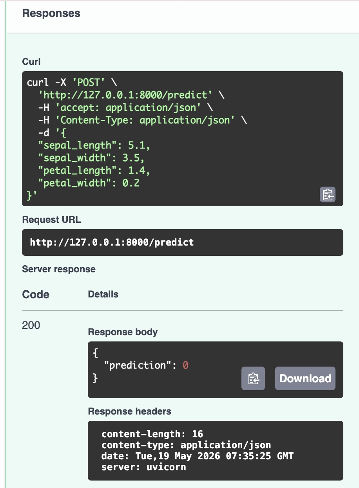

# 🌸 Iris Classification API

A simple Machine Learning API built using FastAPI that predicts the type of Iris flower based on input features.

---

## 🚀 Project Overview

This project uses a trained ML model to classify Iris flowers into three categories:
- Setosa
- Versicolor
- Virginica

The API receives flower measurements and returns a prediction.

---

## 🧠 Tech Stack

- FastAPI
- Python
- NumPy
- scikit-learn
- Pydantic

---

## 🚀 How to Run the Project

### 1. 📥 Install requirements
```bash
pip install fastapi uvicorn numpy scikit-learn pydantic
```
### 2. 🚀 Run the server
```bash
uvicorn main:app --reload
```
### 3.  🌐 Open in browser
```code
http://127.0.0.1:8000
```
### 4. 📚 API Documentation
```code
http://127.0.0.1:8000/docs
```
### 📌 API Endpoint:
POST /predict

Predict the Iris class.

📥 Input:
```JSON
{
  "sepal_length": 5.1,
  "sepal_width": 3.5,
  "petal_length": 1.4,
  "petal_width": 0.2
}
```
📤 Output:
```JSON
{
  "prediction": 0
}

```
---
 ### 🖼️ Project Preview

 💡 Notes

* Make sure all dependencies are installed inside the virtual environment.
* The model was trained using scikit-learn

## 📸 Project Preview

## 📸 Project Preview

<p align="center">
  
  
</p>


---

### 👩‍💻 Author
Built by Eng.Ruba 💻
