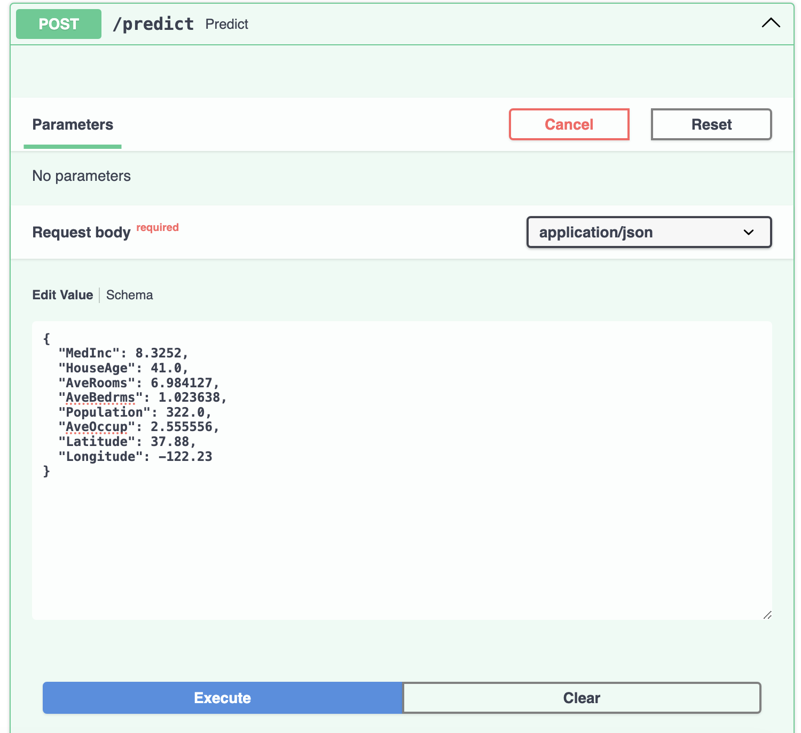
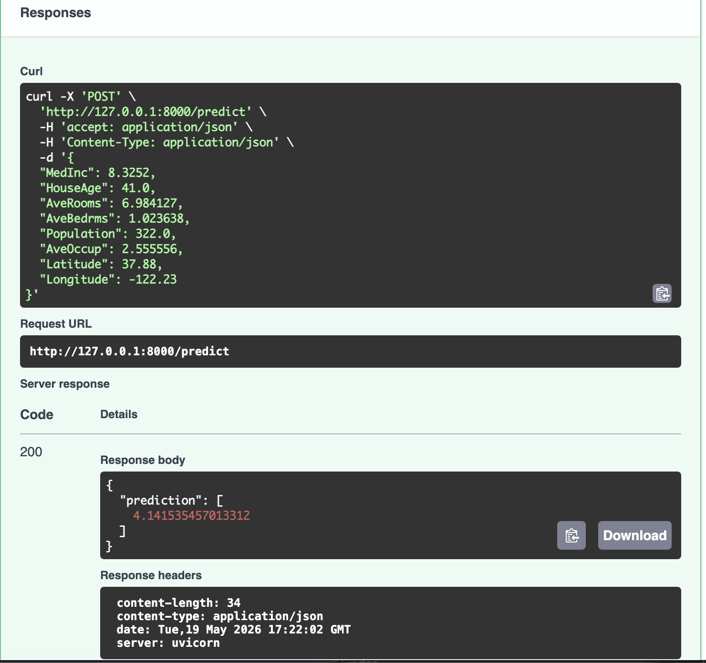

# FastAPI ML Deployment Exercise

This project demonstrates how to deploy a Machine Learning model using:

- FastAPI
- Uvicorn
- Docker
- Scikit-learn

## Project Overview

The API loads a trained Linear Regression model and exposes a prediction endpoint for California housing data.

## Features

The model expects the following input features:

- MedInc
- HouseAge
- AveRooms
- AveBedrms
- Population
- AveOccup
- Latitude
- Longitude

---

## Run Locally

Install dependencies:

```bash
pip install -r requirements.txt
```

Run the FastAPI server:

```bash
python3 -m uvicorn main:app --reload
```

Open Swagger UI:

```text
http://127.0.0.1:8000/docs
```

---

## Run with Docker

Build Docker image:

```bash
docker build -t fastapi-app .
```

Run container:

```bash
docker run -p 8000:80 fastapi-app
```

---

## API Endpoint

### POST `/predict`

Example Request:

```json
{
  "MedInc": 3.2,
  "HouseAge": 10,
  "AveRooms": 5,
  "AveBedrms": 1,
  "Population": 1000,
  "AveOccup": 3,
  "Latitude": 34,
  "Longitude": -118
}
```

Example Response:

```json
{
  "prediction": [2.34]
}
```
## 📸 Project Preview

<p align="center">
  
  
</p>
---

## Author

Developed by Ruba
